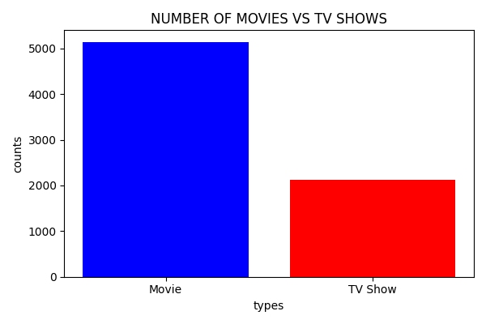
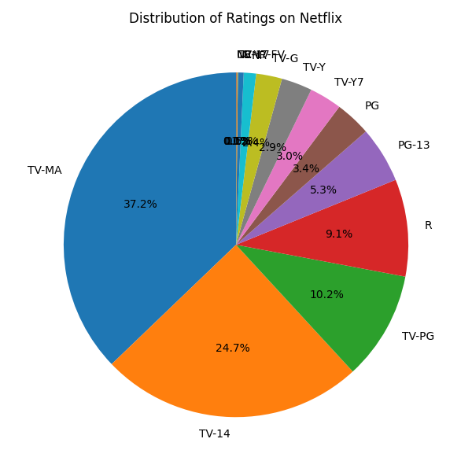
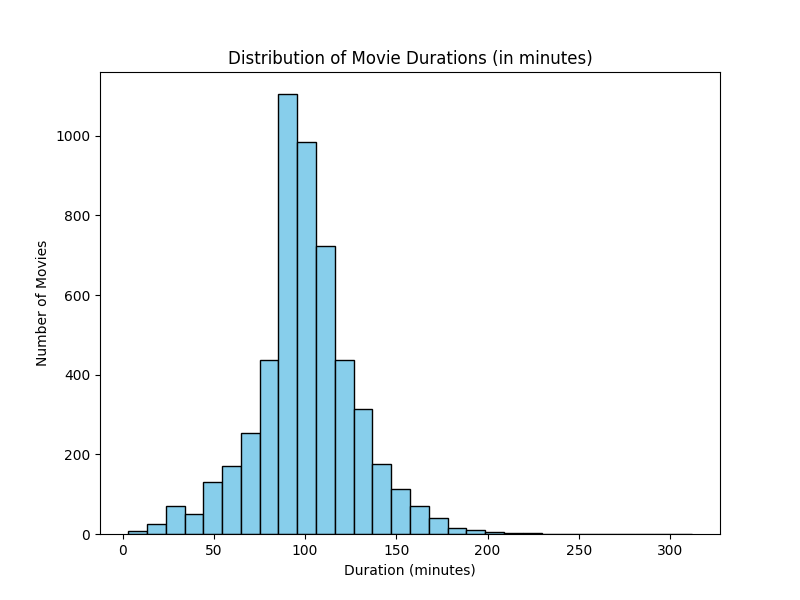
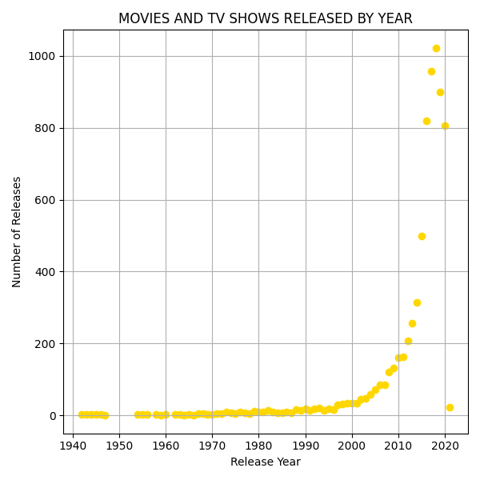
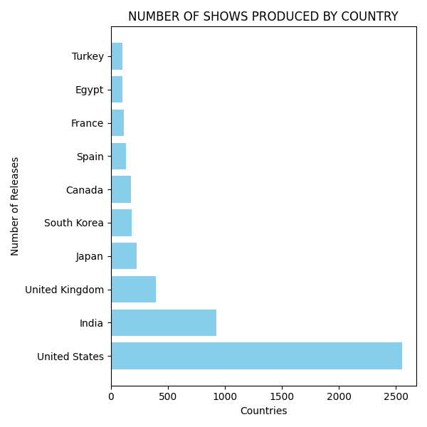
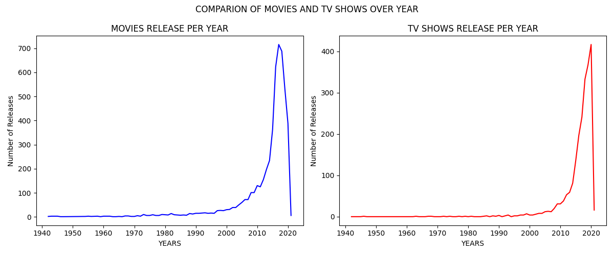

# Netflix Content Analysis

This project performs Exploratory Data Analysis (EDA) on the Netflix Movies and TV Shows dataset using Python.  
The goal of this project is to analyze Netflix content trends, ratings distribution, movie durations, and country-wise content production.

---

## Tools & Technologies Used

- Python
- Pandas
- Matplotlib
- Jupyter Notebook

---

## Dataset

Dataset used: **Netflix Movies and TV Shows Dataset**

Main columns used in analysis:

- Type (Movie / TV Show)
- Release Year
- Rating
- Country
- Duration

---

## Project Objectives

- Compare number of Movies vs TV Shows on Netflix
- Analyze distribution of ratings
- Study movie duration patterns
- Analyze content release trends over the years
- Identify top countries producing Netflix content

---

## Key Visualizations

### Movies vs TV Shows

---

### Rating Distribution

---

### Movie Duration Distribution

---

### Releases Per Year

---

### Top Countries Producing Content

---

### Movies vs TV Shows Released Over Years

---

## Key Insights

- Netflix has more **movies than TV shows**
- Most Netflix content is rated **TV-MA and TV-14**
- The number of releases increased significantly after **2015**
- **United States and India** produce the most Netflix content

---

## Author

Rahul Singh  
BTech CSE | Aspiring Data Analyst
